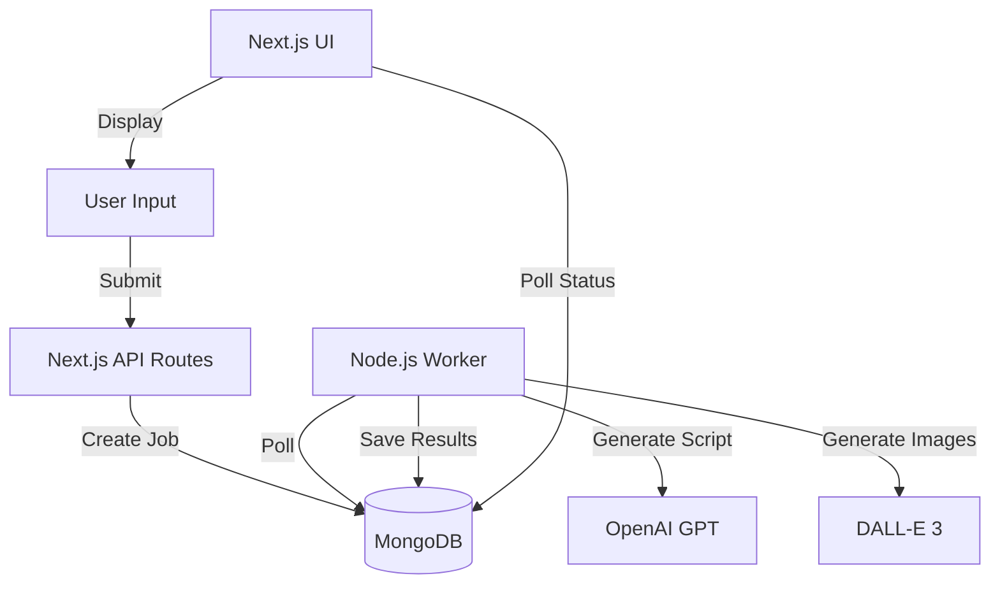

# High-Level Web Flow: IdeaMills

IdeaMills is an AI-powered creative platform for generating marketing concepts, scripts, and storyboards. This document outlines the high-level flow of the application from user interaction to background processing.

## 1. User Input & Ideation Phase (Frontend)

**Entry Point**: `app/page.tsx` (Home) -> `InputForm.tsx`

1.  **Product Details**: User enters product name, description, target audience.
2.  **Creative Configuration**: User selects Theme, Visual Style, Platform (Instagram/TikTok), Duration (10s/30s).
3.  **Optional Inputs**:
    *   **Image Upload**: User can upload product images via `/api/upload`.
    *   **Image Analysis**: AI analyzes uploaded images for visual context via `/api/analyze-images`.
4.  **Idea Generation**:
    *   User clicks "Generate Ideas".
    *   **API Call**: `POST /api/generate-creative-ideas`.
    *   **AI Processing**: OpenAI/Gemini generates 3 unique creative concepts based on inputs.
    *   **Selection**: User selects one concept to proceed.

## 2. Job Creation Phase (API & Database)

**Action**: User clicks "Generate Storyboard" for the selected concept.

1.  **API Request**: `POST /api/generations`.
2.  **Database Operation (MongoDB)**:
    *   Creates a new document in `generations` collection with status `pending`.
    *   Stores all inputs (product details, selected concept, style preferences).
3.  **Queue System**:
    *   Adds a job to the internal job queue (MongoDB-based).
4.  **Response**: Returns `generationId` to the frontend.
5.  **Frontend State**: Redirects to `GenerationHistory.tsx` or `JobStatus.tsx` to poll for progress.

## 3. Background Processing Phase (Worker)

**Component**: `worker/poll.ts` & `worker/runGeneration.ts`

The worker runs independently from the Next.js frontend server to handle long-running AI tasks.

1.  **Polling**: `worker/poll.ts` checks MongoDB for `pending` jobs every 2 seconds.
2.  **Job Pickup**: Finds a pending job, marks it as `processing`.
3.  **Execution (`runGeneration.ts`)**:
    *   **Step 1: Director's Script**:
        *   Calls OpenAI (`gpt-4o` or similar) to generate a second-by-second shooting script.
        *   Structure: Hook (0-6s) -> Problem (6-12s) -> Solution (12-24s) -> CTA (24-30s).
        *   Includes Visuals, Audio, and Transitions.
    *   **Step 2: Storyboard Prompts**:
        *   Extracts visual descriptions from the script.
        *   Optimizes prompts for DALL-E 3 (adding style keywords, lighting, composition).
    *   **Step 3: Image Generation**:
        *   Calls DALL-E 3 API for each scene (parallel or batched).
        *   Downloads generated images.
    *   **Step 4: Storage**:
        *   Saves images to MongoDB GridFS.
        *   Updates the `generations` document with image URLs and script data.
4.  **Completion**:
    *   Marks job status as `completed`.
    *   Updates `completedAt` timestamp.

## 4. Result Display Phase (Frontend)

**Component**: `ResultsDisplay.tsx` & `app/generations/[id]/page.tsx`

1.  **Polling/Updates**: Frontend periodically checks `/api/generations/[id]` status.
2.  **Rendering**:
    *   **Director's Script**: Displays the timeline, dialogue, and visual instructions.
    *   **Storyboards**: Displays the generated images corresponding to each scene.
3.  **Actions**:
    *   **Download**: User can download images or the full script.
    *   **Retry/Regenerate**: User can request a regeneration (creates a new job).

## Technical Architecture

*   **Frontend**: Next.js 14+ (App Router), Tailwind CSS, Lucide React.
*   **Backend**: Next.js API Routes.
*   **Database**: MongoDB (Local or Atlas) with GridFS for image storage.
*   **AI Services**:
    *   **Text/Logic**: OpenAI (GPT-4o) / Gemini.
    *   **Image**: OpenAI (DALL-E 3).
*   **Worker**: Node.js script (`tsx`) running alongside the main app.

## Data Flow Diagram (Conceptual)

